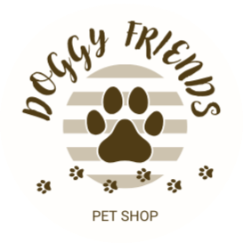

  

# Tienda Online Doggy Friends

Bienvenido a nuestra tienda online especializada en productos para perros. Nuestro sitio web ofrece una amplia variedad de productos para satisfacer las necesidades de tu mascota, desde alimentos nutritivos hasta juguetes divertidos.

## Características del Sitio

- **Navegación Dinámica**: Nuestro sitio cuenta con un navbar dinámico que se adapta según el rol del usuario (Administrador, Depósito, Cliente).
- **Gestión de Usuarios**: Permite a los administradores crear y gestionar usuarios, asignar roles y actualizar información.
- **Carrito de Compras**: Panel lateral que muestra los productos seleccionados, permite modificar cantidades o eliminar productos, y calcula el precio final.
- **Comentarios y Valoraciones**: Los clientes pueden dejar comentarios y valoraciones sobre los productos comprados, ayudando a otros usuarios a tomar decisiones informadas.
- **Cambio de Roles**: Los usuarios pueden cambiar entre los roles asignados a su cuenta según sea necesario.

## Screenshots

## Variables de Entorno

El proyecto utiliza archivos de entorno para manejar configuraciones sensibles y específicas del entorno.

- .env: Archivo principal de configuración de entorno que contiene las variables de entorno reales.

- .env.example: Archivo de ejemplo que muestra las variables de entorno necesarias sin los valores sensibles. Útil para configurar el entorno en diferentes máquinas.

**Nota:** Antes de comenzar con las instalaciones, revise el archivo .env.example y complete su propio archivo .env con las variables de entorno necesarias.

## Tecnologias

Para el desarrollo del proyecto se utilizó:

- **Lenguajes de Programación**: PHP, JavaScript
- **Frameworks**: Bootstrap
- **Bibliotecas**: jQuery, SweetAlert2, AJAX
- **Bases de Datos**: MySQL (utilizando phpMyAdmin para la gestión)
- **Librerías PHP**: phpdotenv, PHPMailer, stripe-php

## Instalación

## Autores

Somos dos desarrolladores apasionados por la tecnología y los perros. Ambos tenemos perros como mascotas, lo que nos inspiró a crear este proyecto.

- [@pabloaldana](https://github.com/pabloaldana)
- [@NachoCayuqueo](https://github.com/NachoCayuqueo)
